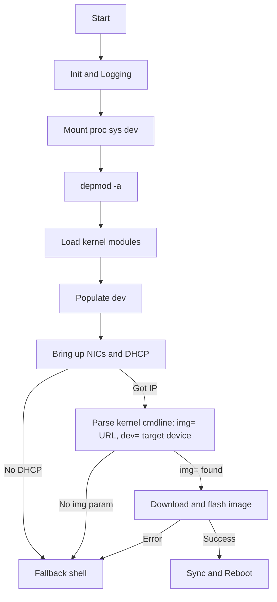

# Flow Diagram

<!-- markdownlint-disable MD013 -->

```mermaid
flowchart TD
    A[Start]
    B[Init and Logging]
    C[Mount proc sys dev]
    D[depmod -a]
    E[Load kernel modules]
    F[Populate dev]
    G[Bring up NICs and DHCP]
    H["Parse kernel cmdline: img= URL, dev= target device"]
    I[Download and flash image]
    J[Sync and Reboot]
    K[Fallback shell]

    A --> B
    B --> C
    C --> D
    D --> E
    E --> F
    F --> G
    G -->|No DHCP| K
    G -->|Got IP| H
    H -->|No img param| K
    H -->|img= found| I
    I -->|Error| K
    I -->|Success| J

```
