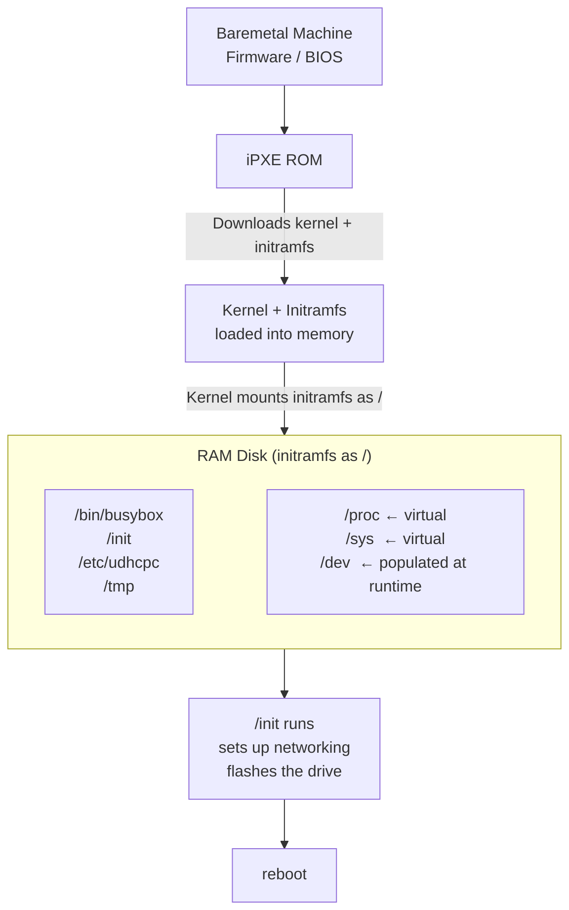

# Initramfs Boot Flow

<!-- markdownlint-disable MD013 -->

```mermaid
%%{init: {'flowchart': {'subGraphTitleMargin': {'top': 10, 'bottom': 10}, 'useMaxWidth': false}}}%%
flowchart TD
    A["Baremetal Machine<br/>Firmware / BIOS"]
    B[iPXE ROM]
    C["Kernel + Initramfs<br/>loaded into memory"]

    subgraph ramdisk ["RAM Disk (initramfs as /)"]
        D1["/bin/busybox<br/>/init<br/>/etc/udhcpc<br/>/tmp"]
        D2["/proc ← virtual<br/>/sys  ← virtual<br/>/dev  ← populated at runtime"]
        D1 ~~~ D2
    end

    E["/init runs<br/>sets up networking<br/>flashes the drive"]
    F[reboot]

    A --> B
    B -->|"Downloads kernel + initramfs"| C
    C -->|"Kernel mounts initramfs as /"| ramdisk
    ramdisk --> E
    E --> F
```
